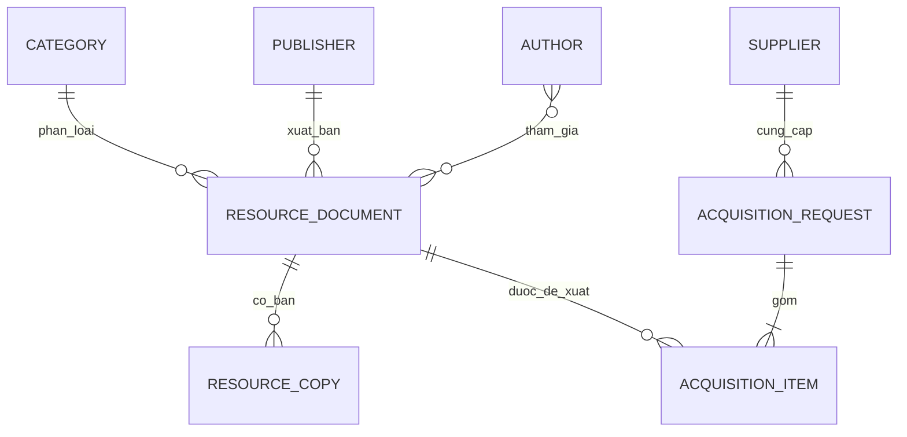

# DocuCatalog

DocuCatalog là ứng dụng web hỗ trợ thư viện và trung tâm học liệu quản lý trọn quy trình từ đề xuất bổ sung, phê duyệt nguồn tài liệu, biên mục đến theo dõi từng bản ấn phẩm.

Dự án được xây dựng bằng Spring Boot, Spring Data JPA, Thymeleaf, Spring Security, Flyway và MySQL. Giao diện dùng tiếng Việt, chạy tốt trên máy tính và điện thoại, có chế độ sáng/tối và không phụ thuộc CDN khi vận hành.

## DocuCatalog giúp làm gì?

- Theo dõi số liệu quan trọng ngay trên trang tổng quan.
- Thêm, xem, sửa, sao chép, tìm kiếm và xóa biểu ghi thư mục.
- Quản lý từng bản ấn phẩm theo số đăng ký cá biệt, vị trí kho, giá, tình trạng vật lý và trạng thái lưu thông.
- Quản lý tác giả, thể loại, nhà xuất bản và nhà cung cấp.
- Lập đề xuất bổ sung, gửi duyệt, phê duyệt hoặc từ chối và hoàn tất nhập kho.
- Tự sinh bản ấn phẩm khi một đề xuất đã duyệt được hoàn tất.
- Tạo tài khoản nội bộ, phân quyền theo công việc và duyệt yêu cầu đăng ký mới.
- Cho phép mỗi người cập nhật hồ sơ, đổi mật khẩu, chọn màu nhận diện và tải ảnh đại diện.
- Bảo vệ dữ liệu bằng BCrypt, CSRF, validation phía máy chủ và các quy tắc nghiệp vụ ở tầng service.

## Luồng sử dụng gợi ý

1. Quản trị viên chuẩn bị dữ liệu danh mục như thể loại, tác giả, nhà xuất bản và nhà cung cấp.
2. Nhân viên bổ sung tạo đề xuất mua hoặc tiếp nhận tài liệu rồi gửi duyệt.
3. Quản trị viên duyệt đề xuất.
4. Nhân viên biên mục hoàn thiện mô tả thư mục và thông tin phân loại.
5. Khi đề xuất được hoàn tất, hệ thống tạo các bản ấn phẩm tương ứng để đưa vào kho.
6. Người dùng tiếp tục cập nhật vị trí, tình trạng và trạng thái lưu thông của từng bản.

## Vai trò và quyền truy cập

| Vai trò | Công việc chính |
| --- | --- |
| `ADMIN` | Toàn quyền, duyệt đề xuất, duyệt tài khoản mới và quản lý phân quyền |
| `CATALOGER` | Biên mục tài liệu, quản lý bản ấn phẩm và dữ liệu danh mục |
| `ACQUISITION` | Lập, gửi và hoàn tất đề xuất bổ sung |

Mọi tài khoản đã được duyệt và đang hoạt động đều có thể xem trang tổng quan, tài liệu và đề xuất. Các thao tác làm thay đổi dữ liệu được giới hạn theo vai trò.

### Vì sao tài khoản mới cần được duyệt?

DocuCatalog hướng tới môi trường nội bộ. Người đăng ký chỉ được chọn công việc mong muốn là biên mục hoặc bổ sung và không thể tự cấp quyền quản trị. Tài khoản mới ở trạng thái `Chờ duyệt`, chưa thể đăng nhập cho đến khi quản trị viên xác nhận.

Quy trình duyệt:

1. Người dùng chọn **Gửi yêu cầu tạo tài khoản** tại trang đăng nhập.
2. Điền thông tin và gửi yêu cầu.
3. Quản trị viên mở **Tài khoản và phân quyền**.
4. Kiểm tra vai trò rồi chọn **Duyệt tài khoản**.
5. Người dùng có thể đăng nhập ngay bằng mật khẩu đã tạo.

## Công nghệ sử dụng

| Thành phần | Công nghệ |
| --- | --- |
| Backend | Java 21, Spring Boot 4.1.1 |
| MVC và giao diện | Spring MVC, Thymeleaf, HTML, CSS, JavaScript |
| Dữ liệu | Spring Data JPA, Hibernate, MySQL 8.4 |
| Migration | Flyway |
| Bảo mật | Spring Security, BCrypt, CSRF |
| Kiểm thử | JUnit 5, Spring Boot Test, H2 |
| Icon | Bootstrap Icons 1.13.1 qua WebJar |
| Build | Maven Wrapper |

## Chạy nhanh không cần MySQL

Đây là cách nhanh nhất để xem giao diện và thử nghiệp vụ. Profile `demo` dùng H2 trong bộ nhớ, tự tạo schema và nạp dữ liệu mẫu. Dữ liệu trong H2 sẽ mất khi dừng ứng dụng.

Trên Windows:

```powershell
.\run-demo.cmd
```

Hoặc:

```powershell
.\mvnw.cmd spring-boot:run "-Dspring-boot.run.profiles=demo"
```

Trên Linux hoặc macOS:

```bash
./mvnw spring-boot:run -Dspring-boot.run.profiles=demo
```

Khi terminal hiện `Started DocuCatalogApplication`, mở <http://localhost:8080>.

Ở chế độ demo, ảnh đại diện được lưu tạm tại `target/demo-uploads/avatars`.

## Tài khoản mẫu

Khi `APP_SEED_DATA=true`, ứng dụng tạo dữ liệu mẫu nếu cơ sở dữ liệu chưa có tài khoản tương ứng.

| Tên đăng nhập | Mật khẩu | Vai trò |
| --- | --- | --- |
| `admin` | `admin123` | Quản trị viên |
| `cataloger` | `catalog123` | Nhân viên biên mục |
| `acquisition` | `acq123` | Nhân viên bổ sung |

Các mật khẩu này chỉ dành cho học tập và trình diễn. Khi dùng với dữ liệu thật, hãy đổi mật khẩu quản trị, xử lý các tài khoản mẫu và đặt `APP_SEED_DATA=false`.

## Kết nối MySQL

### 1. Yêu cầu

- JDK 21 trở lên.
- MySQL 8.x đang chạy.
- Không cần cài Maven riêng vì dự án có Maven Wrapper.

Kiểm tra nhanh:

```powershell
java -version
Get-Service MySQL84
```

Tên dịch vụ MySQL có thể khác trên máy của bạn.

### 2. Tạo database và tài khoản ứng dụng

Đăng nhập MySQL bằng tài khoản quản trị rồi chạy:

```sql
CREATE DATABASE docucatalog
  CHARACTER SET utf8mb4
  COLLATE utf8mb4_unicode_ci;

CREATE USER 'docucatalog'@'localhost'
  IDENTIFIED BY 'hay-thay-bang-mat-khau-manh';

GRANT ALL PRIVILEGES ON docucatalog.*
  TO 'docucatalog'@'localhost';
```

Không nên dùng tài khoản `root` để chạy ứng dụng.

### 3. Tạo cấu hình cục bộ

Trên Windows:

```powershell
Copy-Item .env.example .env.local
notepad .env.local
```

Trên Linux hoặc macOS:

```bash
cp .env.example .env.local
```

Nội dung mẫu:

```properties
DB_URL=jdbc:mysql://localhost:3306/docucatalog?useUnicode=true&characterEncoding=UTF-8&serverTimezone=Asia/Ho_Chi_Minh
DB_USERNAME=docucatalog
DB_PASSWORD=hay-thay-bang-mat-khau-manh
SERVER_PORT=8080
APP_SEED_DATA=true
AVATAR_STORAGE_DIR=./data/uploads/avatars
```

`.env.local` đã được loại khỏi Git. Không commit mật khẩu thật hoặc gửi tệp này cho người khác.

| Biến | Ý nghĩa | Giá trị gợi ý |
| --- | --- | --- |
| `DB_URL` | JDBC URL của MySQL | `jdbc:mysql://localhost:3306/docucatalog?...` |
| `DB_USERNAME` | Tài khoản chỉ dùng cho ứng dụng | `docucatalog` |
| `DB_PASSWORD` | Mật khẩu của tài khoản ứng dụng | Bắt buộc |
| `SERVER_PORT` | Cổng HTTP | `8080` |
| `APP_SEED_DATA` | Có nạp dữ liệu mẫu hay không | `true` khi học tập, `false` khi triển khai thật |
| `AVATAR_STORAGE_DIR` | Thư mục lưu ảnh đại diện | `./data/uploads/avatars` |

Khi triển khai lâu dài, nên dùng đường dẫn tuyệt đối cho `AVATAR_STORAGE_DIR` và cấp quyền đọc/ghi thư mục đó cho tài khoản chạy ứng dụng.

### 4. Khởi động với MySQL

Trên Windows:

```powershell
.\run-mysql.cmd
```

Hoặc chạy trực tiếp:

```powershell
.\mvnw.cmd spring-boot:run
```

Trên Linux hoặc macOS:

```bash
./mvnw spring-boot:run
```

Ứng dụng tự đọc `.env.local` trong thư mục gốc. Khi khởi động thành công, mở <http://localhost:8080>.

### Môi trường MySQL đã chuẩn bị trên máy phát triển hiện tại

- MySQL Server 8.4 chạy bằng Windows Service `MySQL84`.
- Server chỉ lắng nghe trên `127.0.0.1:3306`.
- Schema `docucatalog` và tài khoản ứng dụng đã được tạo.
- Credential ứng dụng nằm trong `.env.local` và không được Git theo dõi.
- Có thể mở MySQL client quản trị bằng credential DPAPI của đúng tài khoản Windows hiện tại:

```powershell
.\tools\mysql-admin.ps1
```

## Flyway và quản lý schema

Với MySQL, Flyway chạy migration trước khi Hibernate kiểm tra schema. Hibernate dùng `ddl-auto=validate`, vì vậy ứng dụng sẽ báo lỗi nếu entity và database không khớp thay vì tự ý sửa dữ liệu.

Các migration hiện có:

| Phiên bản | Nội dung |
| --- | --- |
| `V1__initial_schema.sql` | Schema nghiệp vụ ban đầu |
| `V2__account_profiles.sql` | Thông tin hồ sơ tài khoản |
| `V3__account_registration_and_avatar.sql` | Trạng thái duyệt và tên tệp ảnh đại diện |

Khi đổi cấu trúc dữ liệu:

1. Tạo migration mới với số phiên bản tiếp theo, ví dụ `V4__add_audit_log.sql`.
2. Không sửa migration đã chạy trên database dùng chung.
3. Chạy test.
4. Sao lưu dữ liệu trước khi áp dụng thay đổi lớn.

Profile `demo` và test dùng H2 với schema tạm nên Flyway được tắt ở hai môi trường này.

## Ảnh đại diện được lưu ở đâu?

MySQL chỉ lưu tên tệp. Ảnh thật nằm trong thư mục `AVATAR_STORAGE_DIR`.

- Chỉ chấp nhận PNG hoặc JPEG.
- Dung lượng tối đa 2 MB.
- Máy chủ đọc và xác minh nội dung ảnh, không chỉ tin phần mở rộng tệp.
- Ảnh được cắt vuông ở giữa, đổi về JPEG 256 x 256 rồi mới lưu.
- Tên tệp do hệ thống sinh theo ID tài khoản.

Khi sao lưu hoặc chuyển máy chủ, cần sao lưu cả database và thư mục ảnh. Nếu chỉ phục hồi MySQL mà không phục hồi thư mục ảnh, thông tin tài khoản vẫn còn nhưng ảnh đại diện sẽ không hiển thị.

## Hướng dẫn sử dụng

### Cập nhật hồ sơ và ảnh đại diện

1. Chọn tên hoặc ảnh của bạn ở thanh trên cùng.
2. Cập nhật họ tên, email, đơn vị, điện thoại và phần giới thiệu.
3. Chọn màu nhận diện rồi bấm **Lưu hồ sơ**.
4. Ở thẻ **Ảnh đại diện**, chọn PNG/JPEG và xem trước ảnh.
5. Bấm **Lưu ảnh mới**.

### Chuẩn bị dữ liệu danh mục

Mở **Dữ liệu danh mục** để thêm thể loại, tác giả, nhà xuất bản và nhà cung cấp. Nên chuẩn hóa dữ liệu này trước khi tạo nhiều biểu ghi để tránh trùng lặp tên.

### Biên mục tài liệu

1. Mở **Biên mục tài liệu**.
2. Chọn **Biên mục tài liệu** để tạo biểu ghi.
3. Điền mã biên mục, nhan đề, thể loại và các trường mô tả cần thiết.
4. Chọn tác giả và trạng thái biểu ghi.
5. Lưu biểu ghi, sau đó thêm từng bản ấn phẩm ở trang chi tiết.

Danh sách hỗ trợ tìm theo nhan đề, mã biên mục, ISBN, tác giả hoặc số đăng ký cá biệt. Có thể lọc theo thể loại, trạng thái và dùng chức năng sao chép để tạo nhanh một biểu ghi tương tự.

### Quản lý bản ấn phẩm

Mỗi bản ấn phẩm có số đăng ký cá biệt duy nhất. Bạn có thể theo dõi ngày bổ sung, giá, vị trí, tình trạng vật lý, trạng thái lưu thông và ghi chú. Bản đang được mượn không thể bị xóa.

### Phát triển nguồn tài liệu

1. Mở **Phát triển nguồn** và tạo đề xuất.
2. Chọn nhà cung cấp, ngày dự kiến và các tài liệu cần bổ sung.
3. Nhập số lượng, đơn giá rồi lưu bản nháp.
4. Gửi đề xuất để quản trị viên duyệt.
5. Sau khi được duyệt, hoàn tất đề xuất để hệ thống tự tạo bản ấn phẩm.

Luồng trạng thái hợp lệ:

```text
Bản nháp -> Chờ duyệt -> Đã duyệt -> Hoàn tất
                         hoặc
                      Từ chối
```

### Quản lý tài khoản

Quản trị viên mở **Tài khoản và phân quyền** để:

- Duyệt yêu cầu đăng ký mới.
- Tạo tài khoản trực tiếp cho nhân sự.
- Điều chỉnh họ tên, email và vai trò.
- Tạm khóa hoặc mở lại tài khoản.

Hệ thống không cho người dùng tự hạ quyền hoặc khóa chính mình và luôn giữ ít nhất một quản trị viên hoạt động.

## Mở và chạy trong Eclipse hoặc Spring Tools

Dự án có sẵn metadata Eclipse/m2e, Java 21, UTF-8 và hai shared launch configuration.

1. Mở **File > Import > General > Existing Projects into Workspace**.
2. Chọn thư mục gốc của dự án.
3. Bỏ chọn **Copy projects into workspace** rồi hoàn tất import.
4. Chờ Maven tải dependency.
5. Nếu Eclipse chưa nhận dependency, bấm phải dự án rồi chọn **Maven > Update Project**.
6. Mở **Run > Run Configurations > Java Application**.
7. Chọn một cấu hình:
   - `DocuCatalog - MySQL` để dùng MySQL và `.env.local`.
   - `DocuCatalog - Demo` để dùng H2 tạm thời.
8. Chạy và mở <http://localhost:8080>.

Trên máy phát triển hiện tại, Spring Tools for Eclipse được cài tại:

```text
C:\Users\MSI\Applications\sts-5.4.0.RELEASE\SpringToolsForEclipse.exe
```

Dự án dùng Lombok. Nếu Eclipse báo lỗi ở getter, setter hoặc constructor trong khi Maven vẫn build được, hãy cài Lombok cho đúng bản Eclipse/STS đang dùng rồi khởi động lại IDE.

## Build và kiểm thử

Chạy toàn bộ test:

```powershell
.\mvnw.cmd test
```

Đóng gói executable JAR:

```powershell
.\mvnw.cmd clean package
```

Chạy JAR:

```powershell
java -jar target\docucatalog-1.0.0.jar
```

Bộ test dùng H2 và không thay đổi dữ liệu MySQL thật. Phạm vi kiểm thử gồm:

- Workflow đề xuất và tự tạo bản ấn phẩm.
- CRUD biên mục, tìm kiếm và các ràng buộc khi xóa.
- Quản trị tài khoản, mã hóa và đổi mật khẩu.
- Đăng ký tài khoản công khai ở trạng thái chờ duyệt.
- Kiểm tra, cắt và chuẩn hóa ảnh đại diện.
- Đăng nhập qua HTTP, CSRF và render các màn hình Thymeleaf.
- Khởi động profile demo và nạp dữ liệu mẫu.

Artefact sau build nằm tại `target/docucatalog-1.0.0.jar`.

## Cấu trúc dự án

```text
src/main/java/vn/edu/docucatalog
|-- config       # Security và dữ liệu mẫu
|-- domain       # JPA entity và enum nghiệp vụ
|-- repository   # Spring Data JPA
|-- security     # UserDetails và xác thực
|-- service      # Transaction, lưu ảnh và quy tắc nghiệp vụ
`-- web          # MVC controller, form model và xử lý lỗi

src/main/resources
|-- db/migration # Flyway migration
|-- templates    # Thymeleaf
`-- static       # CSS, JavaScript và asset nội bộ
```

## Mô hình dữ liệu chính



## Quy tắc nghiệp vụ quan trọng

- Mã biên mục, ISBN, số đăng ký cá biệt và mã đề xuất là duy nhất.
- Không xóa tài liệu đã có bản ấn phẩm hoặc đã nằm trong đề xuất bổ sung.
- Không xóa bản ấn phẩm đang được mượn.
- Mỗi tài liệu chỉ xuất hiện một lần trong cùng đề xuất.
- Chỉ bản nháp được sửa.
- Chỉ đề xuất chờ duyệt được phê duyệt hoặc từ chối.
- Chỉ đề xuất đã duyệt được hoàn tất.
- Chỉ xóa được đề xuất ở trạng thái bản nháp hoặc bị từ chối.
- Tài khoản được tạm khóa thay vì xóa để giữ lịch sử và tính toàn vẹn dữ liệu.

## Xử lý sự cố thường gặp

### Không kết nối được MySQL

- Kiểm tra dịch vụ MySQL đang chạy.
- Kiểm tra host, cổng và tên database trong `DB_URL`.
- Kiểm tra `DB_USERNAME` và `DB_PASSWORD`.
- Đảm bảo tài khoản được cấp quyền trên schema `docucatalog`.

### Báo `Access denied for user`

Mật khẩu hoặc host của tài khoản MySQL chưa khớp. Đăng nhập bằng tài khoản quản trị và kiểm tra:

```sql
SHOW GRANTS FOR 'docucatalog'@'localhost';
```

### Cổng 8080 đang được dùng

Đổi `SERVER_PORT` trong `.env.local`, ví dụ:

```properties
SERVER_PORT=8081
```

Sau đó mở `http://localhost:8081`.

### Flyway báo migration hoặc checksum không khớp

Không sửa tệp migration đã được áp dụng. Hãy khôi phục nội dung migration cũ và tạo một migration mới cho thay đổi tiếp theo.

### Ảnh đại diện không lưu được

- Kiểm tra ảnh là PNG hoặc JPEG và không quá 2 MB.
- Kiểm tra ứng dụng có quyền ghi vào `AVATAR_STORAGE_DIR`.
- Nếu dùng đường dẫn tương đối, hãy nhớ nó được tính từ thư mục đang chạy ứng dụng.

### Eclipse không thấy class chính

Class khởi động là:

```text
vn.edu.docucatalog.DocuCatalogApplication
```

Chạy **Maven > Update Project**, xác nhận source folder là `src/main/java`, JDK là 21 trở lên và Lombok đã được cài cho Eclipse.

## Sao lưu

Một bản sao lưu đầy đủ gồm hai phần:

1. Database MySQL `docucatalog`.
2. Toàn bộ thư mục được cấu hình trong `AVATAR_STORAGE_DIR`.

Ví dụ sao lưu database:

```powershell
mysqldump -u docucatalog -p docucatalog > docucatalog-backup.sql
```

Hãy kiểm tra khả năng phục hồi bản sao lưu định kỳ, không chỉ kiểm tra việc tạo tệp.

## Tài nguyên giao diện và giấy phép

- Icon dùng [Bootstrap Icons 1.13.1](https://icons.getbootstrap.com/) từ dự án `twbs/icons`, giấy phép MIT.
- WebJar đóng gói CSS và font vào ứng dụng, vì vậy trình duyệt không cần tải asset từ CDN.
- Bố cục, design token, responsive CSS, hiệu ứng hạt Canvas và JavaScript tương tác là mã nội bộ.
- Quy ước thiết kế nằm trong [DESIGN_SYSTEM.md](DESIGN_SYSTEM.md).

## Tài liệu dự án

Kế hoạch, quyết định kỹ thuật, các lần sửa lỗi và kết quả kiểm thử được ghi theo thời gian tại [DEVELOPMENT_LOG.md](DEVELOPMENT_LOG.md).
