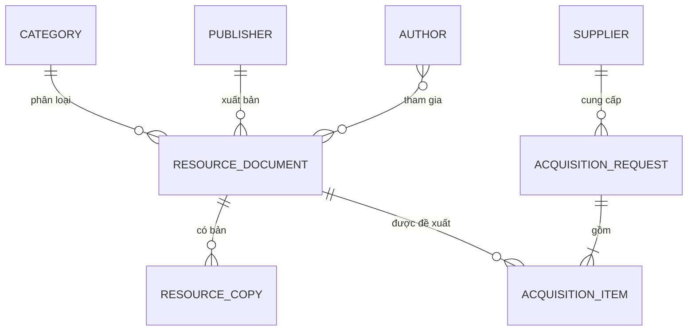

# DocuCatalog

Ứng dụng web quản lý phát triển và biên mục nguồn tài liệu, xây dựng bằng Spring Boot 4.1.1, Spring Data JPA, Thymeleaf, Spring Security và MySQL 8.4.

## Chức năng

- Dashboard thống kê biểu ghi, bản ấn phẩm, đề xuất chờ duyệt và ngân sách đã nhập.
- Biên mục tài liệu đầy đủ Thêm – Xem – Sửa – Xóa; hỗ trợ sao chép một biểu ghi để biên mục nhanh tài liệu tương tự.
- Tìm kiếm theo nhan đề, mã biên mục, ISBN, tác giả hoặc số đăng ký cá biệt; lọc theo thể loại/trạng thái và phân trang.
- Quản lý bản ấn phẩm đầy đủ Thêm – Sửa – Xóa theo số đăng ký cá biệt, ngày bổ sung, giá, vị trí, tình trạng và trạng thái lưu thông.
- Quản lý tác giả, thể loại, nhà xuất bản và nhà cung cấp.
- Quy trình phát triển nguồn: `Bản nháp → Chờ duyệt → Đã duyệt → Hoàn tất` hoặc `Từ chối`.
- Khi hoàn tất đề xuất, hệ thống tự tạo số lượng bản ấn phẩm tương ứng và mã đăng ký không trùng.
- Đăng nhập, phân quyền, BCrypt, CSRF, validation phía server và thông báo nghiệp vụ.
- Quản trị tài khoản: tạo, sửa, phân vai trò, kích hoạt/vô hiệu hóa; mọi người dùng có thể tự đổi mật khẩu.
- Giao diện responsive, hỗ trợ bàn phím và không phụ thuộc CDN.

## Vai trò

| Vai trò | Quyền chính |
| --- | --- |
| `ADMIN` | Toàn quyền, phê duyệt/từ chối đề xuất và quản trị tài khoản |
| `CATALOGER` | Biên mục, bản ấn phẩm, dữ liệu danh mục |
| `ACQUISITION` | Lập, gửi và hoàn tất đề xuất bổ sung |

Mọi người dùng đã đăng nhập đều có quyền xem tài liệu, đề xuất và dashboard.

## Mô hình dữ liệu



## Chạy với MySQL trên máy hiện tại

Máy hiện tại đã được cấu hình MySQL 8.4.9 dưới dịch vụ Windows `MySQL84`. Dịch vụ chạy bằng tài khoản giới hạn `LocalService`, tự khởi động cùng Windows và chỉ lắng nghe ở `127.0.0.1:3306`. Schema `docucatalog`, tài khoản ứng dụng và `.env.local` đã được tạo bằng mật khẩu ngẫu nhiên.

Chạy ứng dụng:

```powershell
.\run-mysql.cmd
```

Lệnh trên nạp biến môi trường từ `.env.local` rồi gọi Maven Wrapper. File bí mật này đã bị loại khỏi Git và được giới hạn quyền đọc bằng ACL của Windows. Khi thấy `Started DocuCatalogApplication`, mở <http://localhost:8080>.

Ứng dụng cũng tự đọc file `.env.local` ở thư mục gốc, vì vậy lệnh chuẩn sau hoạt động trực tiếp trong terminal hoặc IDE mà không cần chép mật khẩu vào cấu hình chạy:

```powershell
.\mvnw.cmd spring-boot:run
```

Credential `root` không lưu dạng văn bản thuần. Trên máy đã thiết lập, có thể mở MySQL client quản trị bằng credential DPAPI của đúng tài khoản Windows hiện tại:

```powershell
.\tools\mysql-admin.ps1
```

## Mở và chạy bằng Eclipse

Dự án có sẵn metadata Eclipse/m2e, UTF-8, Java 21 và hai shared launch configuration. Trên máy hiện tại, Spring Tools for Eclipse 5.4.0 đã được cài tại:

```text
C:\Users\MSI\Applications\sts-5.4.0.RELEASE\SpringToolsForEclipse.exe
```

Lombok 1.18.46 cũng đã được gắn vào bản IDE này. Để mở dự án:

1. Chọn **File → Import → General → Existing Projects into Workspace**.
2. Trỏ đến thư mục `Xay dung ung dung web quan ly phat trien va bien muc nguon tai lieu`, bỏ chọn **Copy projects into workspace**, rồi hoàn tất import.
3. Chờ Maven tải và cập nhật dependency. Nếu cần, bấm phải dự án → **Maven → Update Project**.
4. Mở **Run → Run Configurations → Java Application** và chọn một trong hai cấu hình dùng chung:
   - `DocuCatalog - MySQL`: đọc `.env.local`, dùng MySQL thật.
   - `DocuCatalog - Demo`: dùng H2 trong bộ nhớ, không cần MySQL.
5. Mở <http://localhost:8080> sau khi Console báo `Started DocuCatalogApplication`.

Trên máy khác, dùng JDK 21 trở lên và cài Lombok cho Eclipse theo hướng dẫn chính thức nếu IDE chưa nhận diện các annotation Lombok. Không đưa `.env.local` vào Git hoặc chép mật khẩu vào file `.launch`.

## Chạy demo không cần MySQL

Đây là cách phù hợp để xem và thử ứng dụng trước khi cài cơ sở dữ liệu. Profile `demo` dùng H2 trong bộ nhớ, tự tạo schema và nạp dữ liệu mẫu. Dữ liệu phát sinh trong lúc thử sẽ được xóa khi dừng ứng dụng.

Trên Windows, chạy:

```powershell
.\run-demo.cmd
```

Hoặc gọi Maven Wrapper trực tiếp:

```powershell
.\mvnw.cmd spring-boot:run "-Dspring-boot.run.profiles=demo"
```

Sau khi thấy thông báo `Started DocuCatalogApplication`, mở <http://localhost:8080> và đăng nhập bằng một trong các tài khoản mẫu ở phần dưới. Chế độ này không cần Docker, MySQL hay biến môi trường cơ sở dữ liệu.

## Cấu hình MySQL trên máy khác

Yêu cầu: JDK 21 trở lên và MySQL 8. Maven không cần cài sẵn vì dự án có Maven Wrapper.

1. Tạo cơ sở dữ liệu và tài khoản:

   ```sql
   CREATE DATABASE docucatalog CHARACTER SET utf8mb4 COLLATE utf8mb4_unicode_ci;
   CREATE USER 'docucatalog'@'localhost' IDENTIFIED BY 'replace-with-a-strong-password';
   GRANT ALL PRIVILEGES ON docucatalog.* TO 'docucatalog'@'localhost';
   ```

2. Tạo cấu hình cục bộ và thay mật khẩu mẫu bằng mật khẩu thật:

   ```powershell
   Copy-Item .env.example .env.local
   notepad .env.local
   ```

3. Chạy ứng dụng trên Windows:

   ```powershell
   .\run-mysql.cmd
   ```

   Trên Linux/macOS, xuất các biến `DB_URL`, `DB_USERNAME`, `DB_PASSWORD`, `SERVER_PORT`, `APP_SEED_DATA` rồi chạy:

   ```bash
   ./mvnw spring-boot:run
   ```

4. Mở <http://localhost:8080>.

Kết nối có thể cấu hình bằng biến môi trường:

| Biến | Mặc định |
| --- | --- |
| `DB_URL` | `jdbc:mysql://localhost:3306/docucatalog?...` |
| `DB_USERNAME` | Bắt buộc khi dùng MySQL |
| `DB_PASSWORD` | Bắt buộc khi dùng MySQL |
| `SERVER_PORT` | `8080` |
| `APP_SEED_DATA` | `true` |

## Quản lý schema

- Flyway chạy trước Hibernate ở profile MySQL.
- Migration ban đầu nằm tại `src/main/resources/db/migration/V1__initial_schema.sql`.
- Hibernate dùng `ddl-auto=validate`, vì vậy ứng dụng dừng sớm nếu entity và schema không khớp thay vì tự ý sửa cơ sở dữ liệu.
- Profile `demo` và bộ test dùng H2 với schema tạm, nên Flyway được tắt riêng ở hai môi trường này.
- Khi thay đổi schema, tạo migration mới theo thứ tự `V2__...sql`, `V3__...sql`; không sửa migration đã được áp dụng.

## Tài khoản mẫu

Khi `APP_SEED_DATA=true`, lần khởi động đầu tiên tạo:

| Người dùng | Mật khẩu | Vai trò |
| --- | --- | --- |
| `admin` | `admin123` | Quản trị viên |
| `cataloger` | `catalog123` | Nhân viên biên mục |
| `acquisition` | `acq123` | Nhân viên bổ sung |

Các mật khẩu trên chỉ dành cho trình diễn. Khi triển khai thật, cần đổi/xóa tài khoản mẫu và đặt `APP_SEED_DATA=false`.

## Build và kiểm thử

```powershell
.\mvnw.cmd test
.\mvnw.cmd clean package
```

Bộ test dùng H2 ở chế độ tương thích MySQL, không tác động dữ liệu thật. Kiểm thử hiện có:

- Chạy xuyên suốt workflow đề xuất và xác minh số bản ấn phẩm/mã đăng ký được sinh.
- Đăng nhập qua HTTP với CSRF và render 17 luồng/màn hình Thymeleaf, gồm tạo/sửa/sao chép biểu ghi, sửa bản ấn phẩm, quản trị người dùng, đổi mật khẩu và toàn bộ tab dữ liệu danh mục.
- Kiểm thử CRUD biên mục, tìm theo số đăng ký cá biệt, chặn xóa bản đang mượn/tài liệu còn bản ấn phẩm, băm và đổi mật khẩu tài khoản.
- Khởi động profile `demo` và xác minh tự nạp đúng tài khoản, tài liệu, bản ấn phẩm và đề xuất mẫu.

Artefact sau build: `target/docucatalog-1.0.0.jar`.

## Cấu trúc mã nguồn

```text
src/main/java/vn/edu/docucatalog
├── config       # Security, dữ liệu mẫu
├── domain       # JPA entity và enum nghiệp vụ
├── repository   # Spring Data JPA
├── security     # UserDetails
├── service      # Transaction và quy tắc nghiệp vụ
└── web          # MVC controller, form model, exception handler

src/main/resources
├── templates    # Thymeleaf
└── static       # CSS và JavaScript nội bộ
```

## Tài nguyên giao diện và giấy phép

- Icon dùng [Bootstrap Icons 1.13.1](https://icons.getbootstrap.com/) từ dự án chính thức `twbs/icons`, giấy phép MIT.
- Dependency `org.webjars.npm:bootstrap-icons:1.13.1` đóng gói CSS/font vào artefact; trình duyệt tải từ chính ứng dụng qua `/webjars/**`, không phụ thuộc CDN khi vận hành.
- Bố cục, design token, responsive CSS và JavaScript tương tác là mã nội bộ tại `src/main/resources/static`.

## Quy tắc nghiệp vụ đáng chú ý

- Mã biên mục, ISBN, số đăng ký cá biệt và mã đề xuất là duy nhất.
- Không xóa tài liệu đã có bản ấn phẩm hoặc đã nằm trong đề xuất.
- Không xóa bản ấn phẩm đang được mượn; phải cập nhật đúng trạng thái lưu thông trước.
- Mỗi tài liệu chỉ xuất hiện một lần trong cùng đề xuất.
- Chỉ bản nháp được sửa; chỉ đề xuất chờ duyệt được phê duyệt/từ chối; chỉ đề xuất đã duyệt được hoàn tất.
- Xóa đề xuất chỉ áp dụng cho bản nháp hoặc đề xuất bị từ chối.
- Tài khoản được vô hiệu hóa thay vì xóa để giữ tính toàn vẹn lịch sử; người dùng không thể tự hạ quyền/vô hiệu hóa chính mình và hệ thống luôn giữ ít nhất một quản trị viên hoạt động.
- Credential demo chỉ hiển thị khi `APP_SEED_DATA=true`; khi triển khai thật phải tắt seed data.

## Tài liệu dự án

Quá trình phân tích, kế hoạch, quyết định kỹ thuật và kết quả kiểm thử được ghi tại [DEVELOPMENT_LOG.md](DEVELOPMENT_LOG.md).
